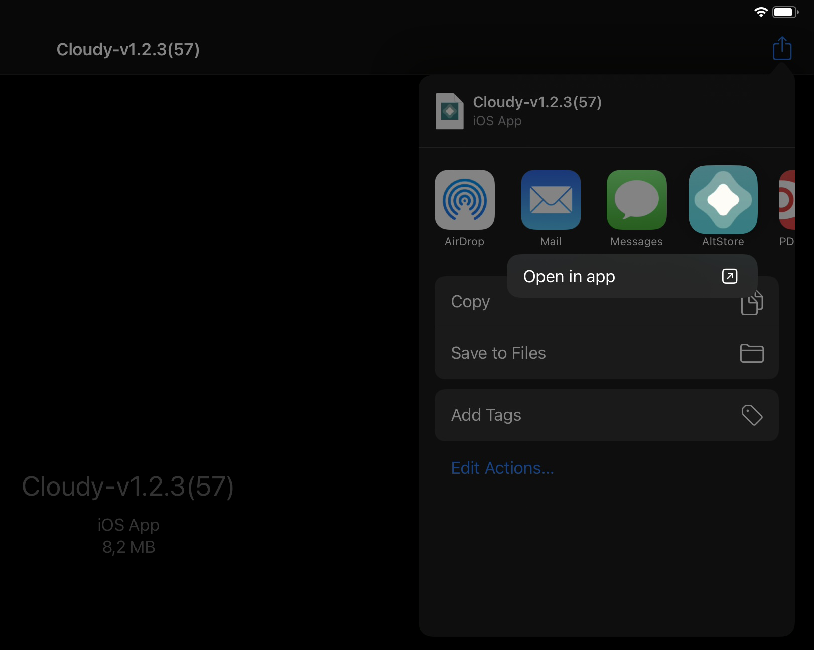

# Cloudy 

A cloud-gaming ready browser for iOS.

# Features

## Supported Features

- Right now it opens the Stadia website automatically on first startup
- Supports Bluetooth® gaming controllers (and keyboards in some titles)
- Supports Fullscreen Mode
- Shortcuts in the address bar (just type in the following alias in order to get to the desired platform)
  - `stadia` -> launch Stadia
  - `gfn` -> launch GeForce NOW
  - `boost` -> launch Boosteroid
- If you want to go _crazy_, you can specify your custom user agent
- Ability to reset all cookies and caches

## Features in development

- Fixing broken axis controls on GeForce NOW
- Touch controls to imitate the mouse
- Keyboard input and control in games
- Virtual controller input

## Trello development board

Feel free to discuss features, bugs and other improvement requests on the public Trello board.
> https://trello.com/b/A2Z965Sf

# Support the development

 Patreon             |  Paypal
:-------------------------:|:-------------------------:
  |  

# Ways to get the Cloudy App on your iDevice

## 1. Build it on your own

Here is a quick guide on how to build the App on your own:

### Prerequisites
An Intel-based Mac running macOS Catalina 10.15.4 or later & Version 12.1 (12A7403) (no other version yet supported)

1. Install [XCode](https://apps.apple.com/de/app/xcode/id497799835?mt=12)
2. Install [Cocoapods](https://cocoapods.org/)
3. Download (or clone) the Cloudy [source code repostiory](https://github.com/mlostekk/Cloudy)
└ look for a green `Code` button, hit it and select `Download ZIP` and Unzip the archive
4. Install pods via `pod install`
5. Doubleclick `Cloudy.xcworkspace`, XCode 12.1 should open
6. Connect the iOS/iPadOS device to your Mac, give it some time to be recognized
7. Select your device in XCode [`1`]
8. Go to `Cloudy` [`2`], select `Signing & Capabilities` [`3`]
9. Select your name inside `Team` [`4`] and change the `Bundle Identifier`[`4`] to something / whatever you like `com.your.favorite.villian`
10. Press run [`5`] and wait until it pops up on your device
11. Have a lot of fun streaming games on iOS/iPadOS

## 2. Sideload an unsigned IPA

### Windows

1. Make sure you have the downloadable binary version of iTunes and iCloud installed on your PC. Do __NOT__ install the version of iTunes or iCloud from the Microsoft Store.
2. Download AltServer (requires Windows 10) from here: https://altstore.io/
3. After installing AltServer, connect your iPhone/iPad with your PC by USB connection. 
4. Open AltServer, and it will open in the hidden icon tray located on the right side of your taskbar (the dropdown button that looks like an up arrow, beside the volume speaker.) and click the AltServer icon (looks like a diamond).

5. Making sure your phone is plugged in, install AltStore to your phone through this menu. You will be prompted to login to your iCloud account.
6. Once you login to your iCloud account and click through any remaining dialog boxes, AltStore will be installed on your phone.
**LEAVE ALTSERVER RUNNING ON YOUR PC!**
AltServer signs Apps remotely, and will do it whenever it sees your iDevice on the same network, so make sure that it stays running so you can continue to use your Apps without issue.
7. Download the latest **.ipa** file as provided from our [Discord](https://discord.gg/9sgTxFx) server
**(Tip: Download it directly on your device and save it in the Files App. Then click and launch it directly in AltStore)**

8. Open AltStore on your device, and navigate to the “My Apps” tab.
(In order to launch the AltStore App, make sure that you have trusted the profile in Settings)

9. Press the “+” button in the top left corner of the screen.
10. Navigate to the downloaded **.ipa** file in the Files App through and select it.
11. Now you can leave AltStore and find the Cloudy App on your Home Screen/App Library.

### Mac

1. Download AltServer (for Mac macOS 10.14.4+) here: https://altstore.io/
2. After installing AltServer to your Mac, plug your iPhone/iPad into your Mac. Once your phone is connected, you can click the AltServer on your status bar ◇ (diamond shaped icon) -> `Install AltStore` -> `choose your device` -> enter your iCloud account info (to assign AltSotre). 

3. After installing AltStore, the App will show up in your iPad/iPhone. You will need to “activate” the App by going to `System settings` -> `General` -> `Device Management` -> to allow the App with iCloud account you put in the previous step (3).
4. Download the latest **.ipa** file as provided from our [Discord](https://discord.gg/9sgTxFx) server and unzip it.
**(Tip: Download it directly on your iPhone/iPad and save it in the Files App. Then click and select to open it directly in AltStore)**

5. Open AltStore on your device, and navigate to the `My Apps` tab.
(In order to launch the AltStore App, make sure that you have trusted the profile in Settings)

6. Press the “+” button in the top left corner of the screen.
7. Navigate to the downloaded **.ipa** file in the Files App through and select it.
8. Now you can leave AltStore and find the Cloudy App on your Home Screen/App Library
9. Leave ALTSERVER RUNNING (on your Mac) to sideload any App or re-sign them before expiration!
10. If you are tired of connecting your iDevice to a Mac every time, you can do this remotely by checking “Sync this iPhone/iPad over Wi-Fi” in iTunes. Then install the mail-plugin on your Mac by clicking AltServer icon -> install mail plugin. Make sure that your Mac and the iDevice are connected to the same Wi-Fi network.
11. AltServer signs the Apps remotely, and will do it whenever it sees your device on the network, so make sure that AltServer running when you re-sign your Apps.

### Mac video guide

